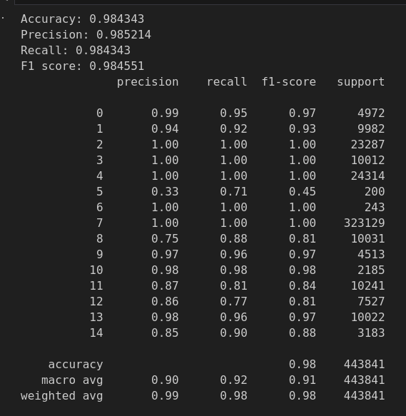

# Predict Attack and Attack Type

- In this article, I will utilize machine learning to detect and classify attacks. You can access the dataset through the following link [page](https://www.kaggle.com/datasets/mohamedamineferrag/edgeiiotset-cyber-security-dataset-of-iot-iiot/data)

# Proceeding Steps
- Read data
- Preprocessing data
- StandardScaler data
- Splitting data
- Training Machine Learning Model

# Result 

